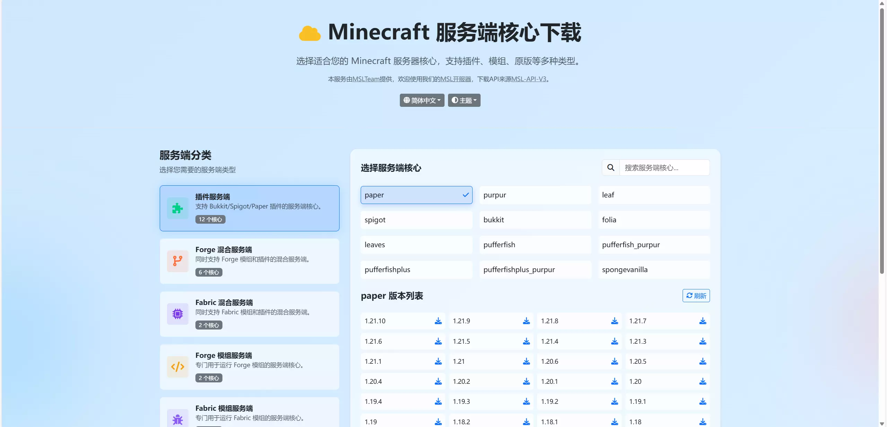

# Minecraft 服务端核心下载器 (Minecraft Server Core Downloader)


这是一个用于下载各种 Minecraft 服务端核心的前端界面，使用原生 JavaScript 和 Bootstrap 构建，由 MSL-API-V3 提供支持。

A front-end interface for downloading various Minecraft server cores, built with vanilla JS and Bootstrap, powered by the MSL-API-V3.

---

### ✨ 功能特性 (Features)

* **动态列表**：从 API 动态获取服务端分类和核心列表。
* **版本选择**：根据选择的核心，异步加载并展示所有可用版本。
* **一键下载**：点击版本即可开始下载，并提供文件校验信息。
* **主题切换**：支持浅色/深色模式，并能自动适配操作系统偏好。
* **多语言支持**：内置简体中文、繁體中文、English，并根据浏览器语言自动切换。
* **响应式设计**：在桌面和移动设备上均有良好的视觉体验。
* **动态背景**：采用 CSS 实现的动态渐变几何背景，视觉效果酷炫。

### 🎨 界面预览 (Screenshot)





### 🛠️ 技术栈 (Tech Stack)

* **前端**: HTML5, CSS3, Vanilla JavaScript (ES6+)
* **UI 框架**: Bootstrap 5, Font Awesome
* **构建工具**: Parcel
* **部署**: GitHub Actions, GitHub Pages
* **后端 API**: MSL-API-V3

### 🚀 快速开始 (Getting Started)

#### 环境要求
* [Node.js](https://nodejs.org/) (推荐 LTS 版本)
* `npm` (通常随 Node.js 一起安装)

#### 本地开发
1.  克隆本仓库到本地：
    ```bash
    git clone https://github.com/MSLTeam/msl-dlservercores-frontend.git
    ```

2.  进入项目目录：
    ```bash
    cd msl-dlservercores-frontend
    ```

3.  安装依赖：
    ```bash
    npm install
    ```

4.  启动本地开发服务器：
    ```bash
    npm run dev
    ```
    项目将在本地地址（例如 `http://localhost:1234`）上运行，并支持热更新。

#### 构建项目
当您准备好发布时，运行以下命令：
```bash
npm run build
```
该命令会使用 Parcel 将所有文件编译、压缩并输出到 `dist` 文件夹中。

### 部署 (Deployment)
本项目已配置 GitHub Actions 工作流。当有新的代码推送到 `main` 或 `master` 分支时，Actions 会自动执行 `npm run build`，并将 `dist` 目录的内容部署到 `gh-pages` 分支，实现自动化发布。

### 📄 授权协议 (License)
本项目基于 **GNU Affero General Public License v3.0 (AGPLv3)** 开源。

简单来说，这意味着您可以自由地：
* **使用**、**修改**和**分发**本软件。
* 如果您通过网络向用户提供基于本软件修改后的服务，您**也必须**将您的修改后的完整源代码以同样的 AGPLv3 协议开源。

详情请参阅 [LICENSE](LICENSE) 文件。

### ❤️ 致谢 (Acknowledgements)
* 本项目由 [MSLTeam](https://github.com/MSLTeam) 提供。
* 所有下载资源均来自 [MSL-API-V3](https://www.mslmc.cn/docs/other/msl-mirrors.html)。
* 欢迎使用我们的 [MSL 开服器](https://www.mslmc.cn/)。